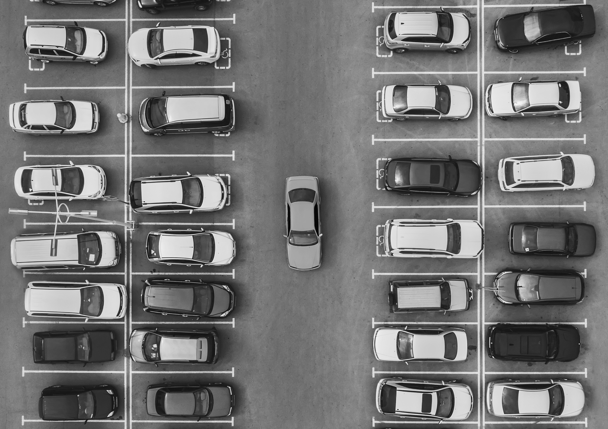
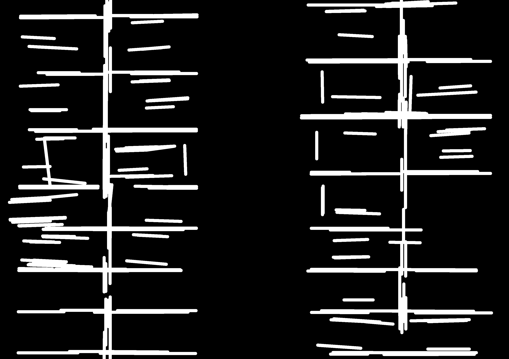
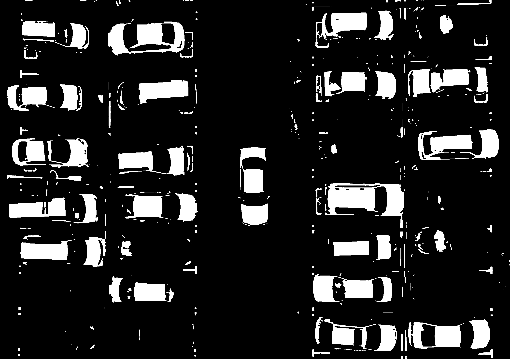
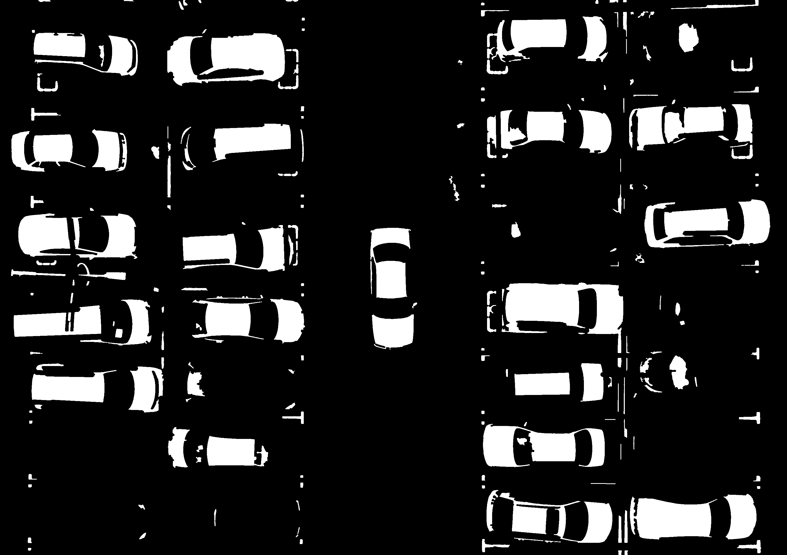
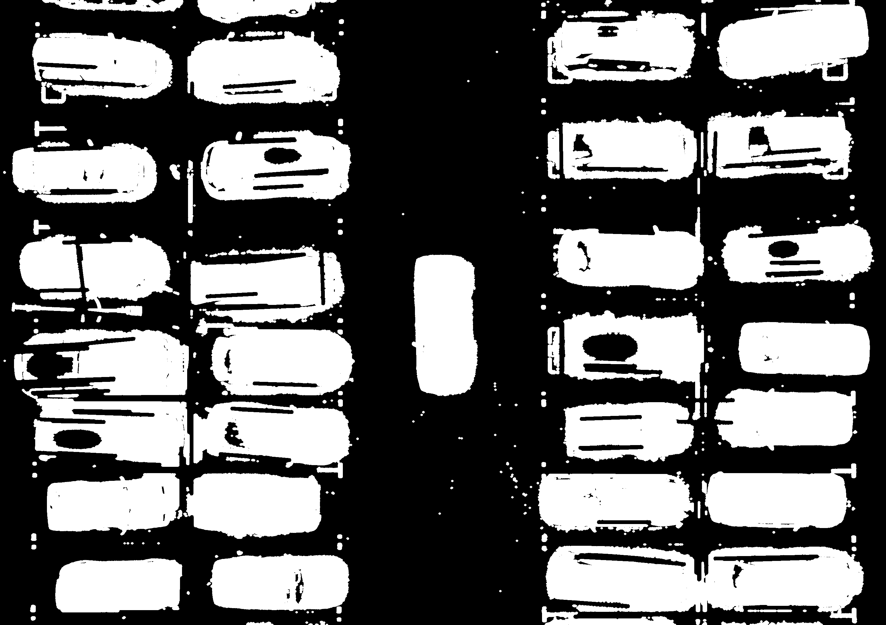
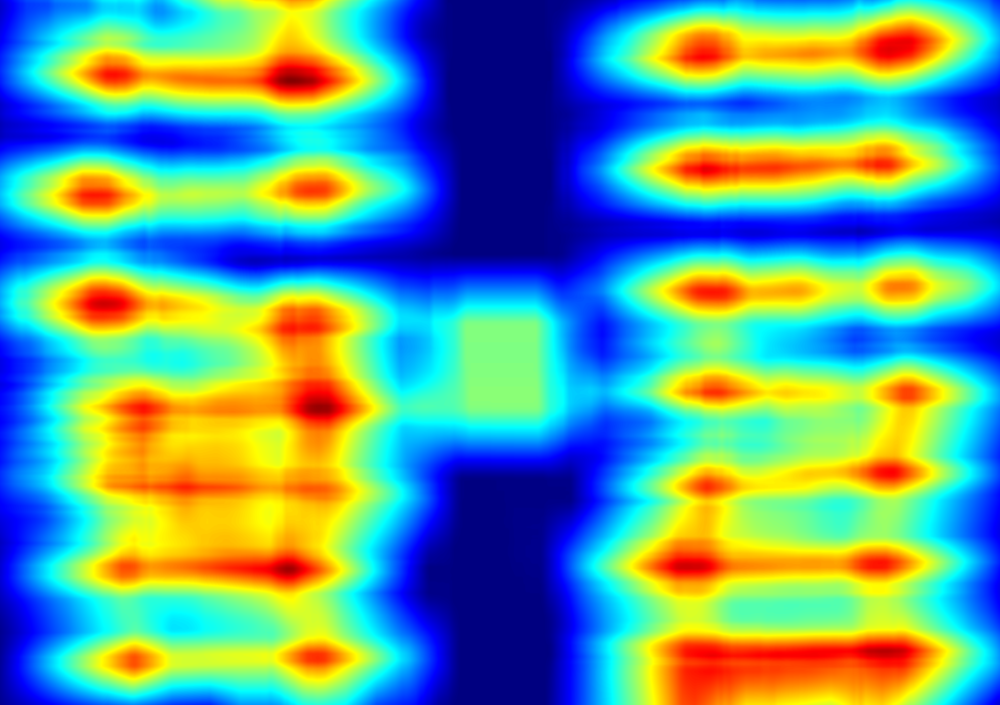
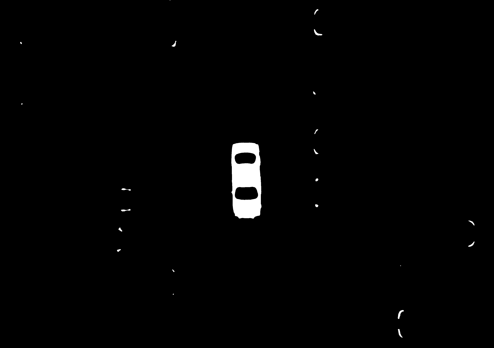

# Mini Project 2 — Object Counting

Program menghitung mobil pada foto aerial area parkir dengan pengolahan citra klasik. Pipeline menggabungkan **Otsu thresholding, morphology, contour filtering, dan density-based localization**. Tidak digunakan deep learning atau model pre-trained.

## Identitas

- **Nama:** Muhammad Syaiful Kalam`
- **NRP:** `5024241093`

## Hasil

Program mendeteksi **29 mobil**.


## Pipeline

1. Citra dikonversi ke LAB dan kanal **Lightness** dihaluskan dengan Gaussian blur `7 × 7`.
2. **Otsu thresholding** memisahkan area terang dari aspal secara otomatis.
3. Marka putih panjang dideteksi melalui threshold HSV, Canny, dan Hough Line Transform, lalu dikurangi dari mask Otsu.
4. **Morphological opening dan closing** membersihkan noise dan menyatukan bagian objek.
5. `cv2.findContours` membentuk mask kandidat dari contour dengan luas yang masuk akal.
6. Bukti kontras lokal dan warna ditambahkan agar mobil gelap tidak seluruhnya hilang akibat Otsu.
7. Density map menghitung kepadatan kandidat dalam jendela berukuran mendekati satu mobil.
8. Non-maximum suppression merapikan contour yang terpecah menjadi satu kotak per kendaraan.
9. Mobil merah di tengah diproses dengan contour HSV terpisah karena orientasinya vertikal.

## Visualisasi Tahapan

| Tahap | Hasil |
|---|---|
| LAB Lightness |  |
| Otsu threshold |  |
| Mask marka parkir |  |
| Hasil morfologi |  |
| Mask contour |  |
| Bukti penampilan |  |
| Density heatmap |  |
| Mask mobil merah |  |

## Analisis

Otsu saja cenderung kehilangan mobil gelap dan memecah satu mobil menjadi beberapa contour. Karena itu, contour Otsu dipakai sebagai bukti awal lalu digabungkan dengan kontras lokal. Density filtering membuat bounding box lebih konsisten dibanding menggambar setiap contour mentah.

Program menghasilkan 28 deteksi horizontal dan satu mobil merah vertikal. Dua kendaraan dengan respons paling lemah atau hanya terlihat sebagian tidak melewati threshold density, sehingga hasil akhirnya 29. Metode ini masih bergantung pada skala dan orientasi citra. Untuk gambar lain, ukuran jendela dan threshold perlu disesuaikan.

## Cara Menjalankan

```bash
python -m pip install numpy opencv-python
python maincode.py
```

Pilihan tambahan:

```bash
python maincode.py --input input/parking.jpg --output output
```

## Referensi

- [Spesifikasi MP2 Object Counting](https://github.com/partadox/pcv-mini-project/blob/main/MP2_Object_Counting.md)
- [OpenCV: Image Thresholding](https://docs.opencv.org/4.x/d7/d4d/tutorial_py_thresholding.html)
- [OpenCV: Morphological Transformations](https://docs.opencv.org/4.x/d9/d61/tutorial_py_morphological_ops.html)
- [OpenCV: Contours](https://docs.opencv.org/4.x/d4/d73/tutorial_py_contours_begin.html)
